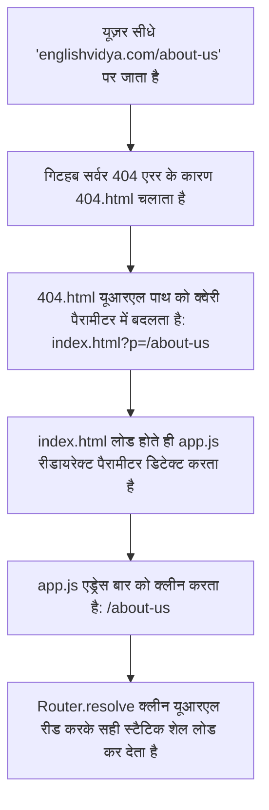

# 🎓 English Vidya — System Architecture & Engines

यह दस्तावेज़ English Vidya के आर्किटेक्चर, उसके कोर इंजनों, राउटिंग फ्लो, और कार्य करने की प्रणालियों की व्याख्या करता है।

---

## 🚀 1. हाइब्रिड राउटिंग सिस्टम (The Hybrid Router)

राउटर पाथ-आधारित क्लीन यूआरएल (HTML5 History API) और स्थानीय ऑफ़लाइन हैश-आधारित राउटिंग का मिश्रण है।

### A. ऑनलाइन क्लीन पाथ फ्लो (Live Clean Paths Flow)

### B. ऑफ़लाइन फ़ॉलबैक मोड (Offline fallback / file:// protocol)
* यदि `location.protocol === 'file:'` होता है (जैसे ऑफ़लाइन डबल-क्लिक करने पर), तो राउटर `state.isHashMode = true` सेट करता है।
* यह `history.pushState` को ब्लॉक कर देता है ताकि सुरक्षा त्रुटियां (CORS / Security Exceptions) न आएं, और चुपचाप हैश राउटिंग (`englishvidya.com/#/about-us`) पर काम करता है।

---

## 🎨 2. सर्कुलर थीम ट्रांज़िशन (Theme Reveal Wave Engine)

डार्क और लाइट मोड स्विच करते समय, यूज़र इंटरफ़ेस में एक सुंदर गोलाकार लहर एनीमेशन बनता है।
1. **क्लिक ओरिजिन डिटेक्ट करना:** जावास्क्रिप्ट क्लिक इवेंट के `clientX` और `clientY` कोऑर्डिनेट्स से क्लिक का सटीक केंद्र ढूंढता है।
2. **डायनामिक ट्रांज़िशन वेव बनाना:** एक `div.theme-transition-wave` एलिमेंट बनाकर उसे क्लिक कोऑर्डिनेट्स पर सेट किया जाता है।
3. **सीएसएस ट्रांसफ़ॉर्म स्केल:** वेव का साइज बढ़ा दिया जाता है ताकि वह स्क्रीन के विकर्ण (diagonal) को पूरी तरह कवर कर सके।
4. **थीम स्विच:** एनीमेशन पूरा होने पर नेटिव `data-theme` को बदलकर वेव को हटा दिया जाता है।

---

## 🔍 3. ज़ीरो-कॉस्ट क्लाइंट-साइड सर्च (Fuzzy Client-Side Search)

* **लोडिंग:** पृष्ठभूमि में `index.html` लोड होने के 2 सेकंड बाद `loadJSON` के जरिए `/data/site/search-index.json` को आलसी तरीके से (lazily) लोड किया जाता है।
* **फिल्टर:** इनपुट इवेंट्स को 150ms के लिए डीबाउंस (debounced) किया जाता है ताकि कीबोर्ड टाइपिंग पर सीपीयू पर भार न पड़े।
* **मैचिंग:** क्वेरी को लोअरकेस करके इंडेक्स में `w` (शब्द) और `m` (अर्थ) दोनों फील्ड्स पर सर्च की जाती है, और शीर्ष 20 परिणामों को तत्काल रेंडर किया जाता है।

---

## 🃏 4. स्पेस-रेपेटिशन फ़्लैशकार्ड इंजन (Flashcards Progression)

* **स्टेट ट्रैकिंग:** यूज़र के फ्लैशकार्ड प्रोग्रेस को LocalStorage में `ev-fc-progress` कुंजी के अंतर्गत सुरक्षित रखा जाता है।
* **प्रोग्रेस रेटिंग:** यदि यूज़र "मुझे पता है (Know)" दबाता है, तो कार्ड को प्रोग्रेस डेक से हटा दिया जाता है। यदि "मैं भूल गया (Don't Know)" दबाता है, तो कार्ड को डेक के अंत में दोबारा अभ्यास के लिए रख दिया जाता है।

---

## 📲 5. PWA और ऑफ़लाइन स्टडी (Offline First PWA Architecture)

* **Service Worker:** `service-worker.js` पृष्ठभूमि में सभी एचटीएमएल, सीएसएस, जावास्क्रिप्ट, फोंट्स, और सर्च इंडेक्स JSONs को ब्राउज़र के `Cache Storage` में कैश कर लेता है।
* **Cache-First Strategy:** अगली बार साइट खोलने पर, यदि इंटरनेट अनुपलब्ध है, तो सर्विस वर्कर कैश से तत्काल डेटा लोड कर देता है, जिससे नेटवर्क कनेक्टिविटी के बिना भी वेबसाइट सुचारू रूप से चलती है।
