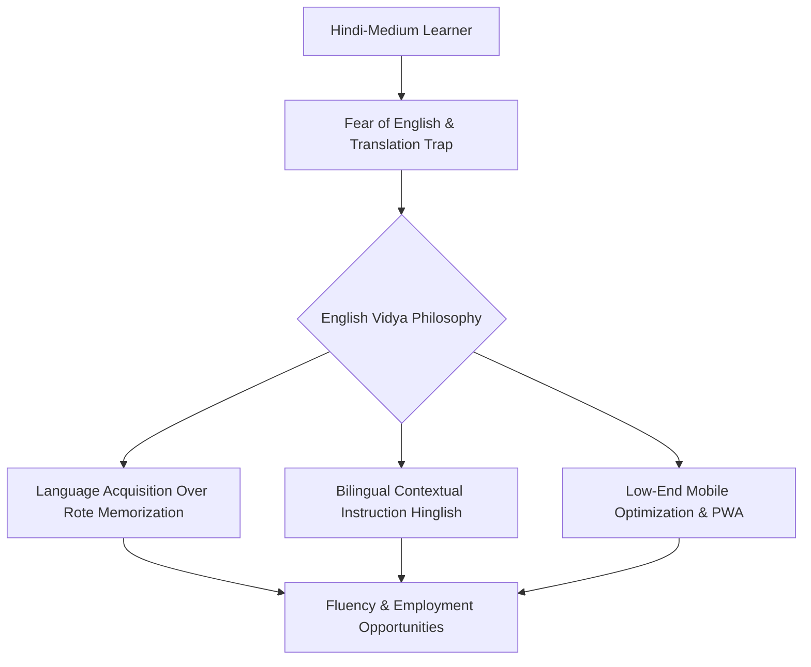

# Module 1: Executive Summary - English Vidya

## 1. Project Overview & Vision
**English Vidya** (https://englishvidya.com) is a modern, fast, mobile-first bilingual English learning platform designed specifically for Hindi-medium students, beginners, rural learners, and students who want to master English from basic to advanced levels. 

In India, English is not just an academic subject; it is a gateway to employment, social mobility, and digital opportunities. However, the traditional educational system treats English as a set of rules to be memorized for exams, rather than a language of active communication. English Vidya bridges this gap by offering a structured, distraction-free, low-cost, and high-performance digital ecosystem that makes language acquisition intuitive and natural.

---

## 2. Target Audience Analysis
Our primary target audience consists of:
* **Hindi-Medium School Students (Class 6th–12th):** Who struggle to comprehend standard English textbooks and need clear, parallel Hindi-medium explanations.
* **Rural and Semi-Urban Learners:** Students in Tier-2, Tier-3 cities, and villages who lack access to premium English-speaking coaching centers.
* **Adult Beginners & Job Seekers:** Individuals who can read basic English but cannot speak confidently due to hesitation and translation lag.
* **Low-End Android Device Users:** Students accessing the web via budget smartphones (under ₹10,000 / $120) with limited RAM, slow processors, and unstable or slow mobile internet connections (2G/3G/4G).

### Learner Persona Matrix
| Persona Segment | Core Pain Point | Immediate Needs | English Vidya Solution |
| :--- | :--- | :--- | :--- |
| **Rural School Student** | Academic failure, fear of grammar exams | School syllabus support, simple explanations | Parallel Hindi-English grammar notes with practical examples. |
| **College Graduate / Job Seeker** | Rejection in job interviews due to poor speaking | Hesitation removal, interview English | Instant Response System, opinion expression, corporate English. |
| **Household / Everyday Learner** | Inability to understand daily conversation | Survival vocabulary, daily-life patterns | Ultra Common Daily Vocabulary drills, weather, colors, and direction vocabulary. |

---

## 3. Pedagogical Philosophy
English Vidya's teaching methodology is built on modern language acquisition research tailored specifically to Hindi-medium psychology. It stands on three core pillars:

### Pillar 1: Acquisition Over Memorization
Instead of forcing students to memorize abstract grammatical definitions (e.g., *"What is an abstract noun?"*), we teach how words function dynamically in sentences. Grammatical concepts are introduced only after the student understands their utility in daily communication.

### Pillar 2: The Bilingual Transition Model (Hindi to English)
We recognize that learners naturally think in their native language (Hindi) during the early stages. Instead of ignoring this, English Vidya utilizes a structured transition:
* **Hinglish/Bilingual Explanations:** Core concepts explained in a highly engaging, classroom-style Hindi-mixed-with-English (Hinglish) tone.
* **SOV to SVO Correction:** Hindi is a Subject-Object-Verb (SOV) language (*"मैं चाय पीता हूँ"*), whereas English is a Subject-Verb-Object (SVO) language (*"I drink tea"*). We explicitly drill this syntax shift to eliminate literal translation traps.
* **Pronunciation & Phonics:** Natively written pronunciation support in Devanagari script to correct common regional pronunciation errors.

### Pillar 3: Speed, Spontaneity & Spoken Drills
Real fluency requires reducing the translation lag in the brain. The platform uses sentence pattern drills (e.g., *"Go"* $\rightarrow$ *"I go, we go, you go, he goes"* $\rightarrow$ *"I don't go, do you go?"*) to build muscular and cognitive muscle memory, making sentence production automatic.

---

## 4. Key Platform Parameters
To fulfill the goal of a premium student experience at the lowest possible cost, the system operates under the following engineering parameters:

* **Mobile-First Progressive Web App (PWA):** Must operate as a native-feeling app on Android. Fully responsive, lightweight, and installable with zero-byte updates.
* **Ultra-Fast Performance:** Single Page Application (SPA) loading within 1.5 seconds on slow 3G connections. Minimal JavaScript execution overhead.
* **Low-Cost Cloud Native Infrastructure:** Leverages serverless architectures (Cloudflare Pages + Workers) and object storage (Cloudflare R2) to scale up to millions of users with near-zero hosting costs.
* **Distraction-Free UX:** Zero intrusive ads, popups, or complex layouts. Designed to keep the focus entirely on the learning material, mimicking a premium book or dedicated e-reader.
* **Spam-Proof Community:** A secure, zero-cost social interaction system built on Google Sign-In and Cloudflare edge databases to facilitate student questions without moderation headaches.
