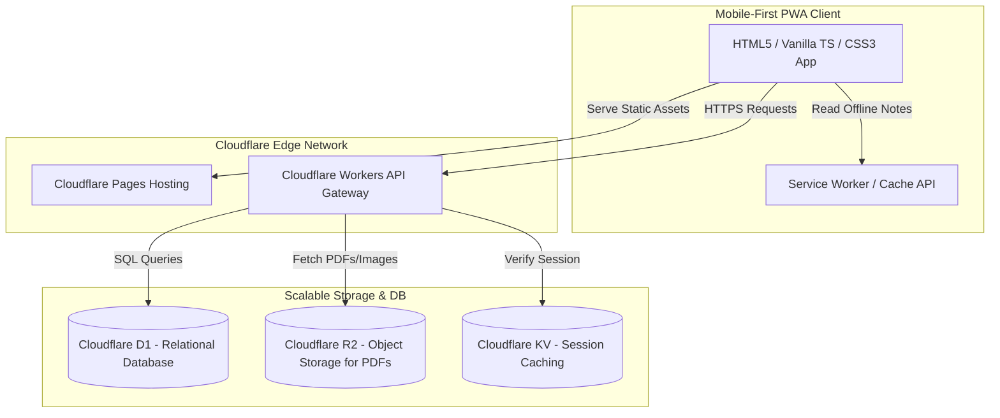

# Module 2: Technical Architecture & Core Tech Stack - English Vidya

## 1. Tech Stack Selection (The Zero-Cost Premium Model)
To build a highly optimized, low-cost system that scales seamlessly without breaking the bank, we avoid traditional VPS servers (like AWS EC2, DigitalOcean) and expensive premium hosted backends (like Clerk or Auth0). Instead, we utilize an **Edge-Serverless Architecture** built entirely on the Cloudflare ecosystem.



### Technical Stack Comparison Matrix
| Architectural Layer | Traditional Setup | Recommended "Jugaad" Stack | Reason for Selection | Cost (up to 100k MAUs) |
| :--- | :--- | :--- | :--- | :--- |
| **Frontend Framework** | React / Next.js | **Vite + Vanilla TypeScript** | Ultra-lightweight compile size (under 50KB bundle), near-instant execution on old CPUs. Next.js has severe hydration lag on $100 Android phones. | **FREE** |
| **Frontend Hosting** | Vercel / Netlify | **Cloudflare Pages** | Multi-region edge distribution. Unlimited free bandwidth (unlike Vercel's strict 100GB limit which leads to billing surprises). | **FREE** |
| **Backend API Layer** | Node.js (Express) on VPS | **Cloudflare Workers** | Edge execution in V8 isolates. Zero cold starts, global latency under 15ms. Free tier allows 100,000 requests per day. | **FREE** ($5/mo if exceeded) |
| **Database** | Managed PostgreSQL | **Cloudflare D1 (SQLite)** | Serverless, SQL-compliant edge database. Native Cloudflare integration, fast reads. Free tier includes 5 Million read rows / day. | **FREE** |
| **Static Asset Storage** | AWS S3 Bucket | **Cloudflare R2** | Zero-egress fee object storage. Saves massive costs on PDF downloads and images. Free tier includes 10GB storage. | **FREE** |
| **PWA Native Wrapper** | React Native / Flutter | **CapacitorJS / Tauri v2** | Allows the exact web code to be packaged as a lightweight Android App (APK) and Windows App (EXE) with zero duplication. | **FREE** |

---

## 2. Cloudflare Serverless Architecture
By building inside the Cloudflare ecosystem, we deploy our frontend static pages directly onto Cloudflare's Edge nodes. 
* **Vite Compile Pipeline:** The frontend compiles into standard static HTML, CSS, and JS. 
* **Cloudflare Workers (Edge API):** Standard APIs for progressive features (bookmarking words, tracking lessons, processing comments) run on Cloudflare Workers. Workers use lightweight V8 isolates instead of heavy Node.js containers, meaning memory usage is under 1MB and API calls execute in milliseconds from the nearest Indian CDN node (Mumbai, Delhi, Bangalore, Chennai).
* **Cloudflare R2 Storage:** Standard educational PDFs, homework exercises, and vocabulary card images are stored in R2. Because R2 has **zero egress fees**, when thousands of students download study materials, the server bill remains exactly ₹0.

---

## 3. PWA (Progressive Web App) Architecture
To deliver an app-like experience on slow networks in rural areas, the website is built as an installable PWA.

### PWA Components
1. **Web App Manifest (`manifest.json`):** Defines the app name, icons, splash screen, display mode (`standalone` to hide browser UI), and theme colors.
2. **Service Worker (`sw.js`):** A client-side script running in the background to handle caching.
3. **Cache Storage API:** Implements the **Stale-While-Revalidate** caching strategy.

```javascript
// Sample Service Worker Strategy (Stale-While-Revalidate)
const CACHE_NAME = 'english-vidya-v1';
const ASSETS_TO_CACHE = [
  '/',
  '/index.html',
  '/css/style.css',
  '/js/app.js',
  '/assets/logo.png',
  '/offline.html'
];

self.addEventListener('install', (event) => {
  event.waitUntil(
    caches.open(CACHE_NAME).then((cache) => {
      return cache.addAll(ASSETS_TO_CACHE);
    })
  );
});

self.addEventListener('fetch', (event) => {
  event.respondWith(
    caches.match(event.request).then((cachedResponse) => {
      const fetchPromise = fetch(event.request).then((networkResponse) => {
        if (networkResponse.status === 200) {
          caches.open(CACHE_NAME).then((cache) => {
            cache.put(event.request, networkResponse.clone());
          });
        }
        return networkResponse;
      });
      return cachedResponse || fetchPromise;
    }).catch(() => {
      // Fallback for offline usage
      if (event.request.mode === 'navigate') {
        return caches.match('/offline.html');
      }
    })
  );
});
```

### PWA Capabilities
* **Homescreen Installation:** Prompts the student to "Install English Vidya" on their phone screen. This bypasses the Google Play Store search friction.
* **Offline Caching:** All textbook grammar lessons and vocabulary cards, once loaded, are stored locally on the phone's browser cache. A student can read their notes even inside a train or remote village with zero network connection.
* **Instant Start:** Subsequent page loads are local and instant.

---

## 4. Mobile & Desktop App Conversion (Future-Ready wrappers)
When the student base expands and demands standalone apps, the codebase requires **zero rewrites**:

* **Android App (via CapacitorJS):** CapacitorJS wraps the web code in a high-performance native WebView wrapper. Native plugins allow direct integration of native Google Sign-In and local SQLite databases.
  * *App Size:* Typically under 5MB (compared to Flutter/React Native apps which start at 35MB).
  * *Distribution:* Directly distributed as an `.apk` via WhatsApp/Telegram or uploaded to the Google Play Store.
* **Windows App (via Tauri v2):** Tauri v2 wraps the web app in a native Windows WebView2 (Edge Chromium-based) wrapper. Using Rust for backend bindings, Tauri compiles into a standalone, extremely fast `.exe` file under 8MB, running smoothly on low-end school computers in rural India.
