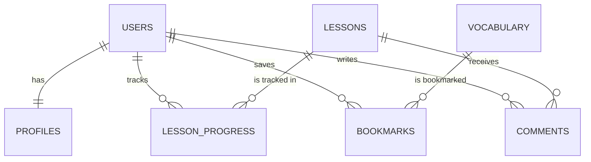

# Module 3: Database Architecture & Schema Design - English Vidya

## 1. Database Infrastructure Selection
For database operations, we have selected **Cloudflare D1** (built on SQLite) for the primary application state, with an option to use **Supabase PostgreSQL** for advanced analytics or complex relational workloads.

### Selection Reasoning
* **Cloudflare D1:** D1 is fully integrated into the Cloudflare Worker serverless ecosystem. Queries execute instantly within the edge runtime without connection pool overhead. This prevents "connection pool exhaustion" bugs common in standard serverless databases (like Lambda + PostgreSQL).
* **Cost:** D1 includes a generous free tier of **5 Million read rows** and **100,000 write rows** per day. A student reviewing their profile or notes reads approximately 10 rows. This means D1 can support up to **50,000 daily active users completely free**.

---

## 2. Relational Database Schema Design
Below is the highly optimized relational database structure, designed to track student progress, lessons, vocabulary, and comment interactions with minimal storage footprint.



### Table Definitions (D1 SQLite Compatible)

```sql
-- 1. Users Table (Core Auth Data synced from Google Sign-In)
CREATE TABLE users (
    id TEXT PRIMARY KEY,                       -- Unique identifier (Subject string from Google OAuth)
    email TEXT UNIQUE NOT NULL,                -- User's email address
    created_at INTEGER DEFAULT (strftime('%s', 'now')), -- Epoch timestamp of account creation
    last_login INTEGER DEFAULT (strftime('%s', 'now'))  -- Last active session timestamp
);

-- 2. Student Profiles Table (Demographics & Settings)
CREATE TABLE profiles (
    user_id TEXT PRIMARY KEY,
    full_name TEXT NOT NULL,
    avatar_url TEXT,
    preferred_language TEXT DEFAULT 'hi',      -- 'hi' for Hindi-mixed (Hinglish), 'en' for English
    difficulty_level TEXT DEFAULT 'basic',     -- 'basic', 'intermediate', 'advanced'
    streak_count INTEGER DEFAULT 0,            -- Consecutive active days for gamification
    last_active_date TEXT,                     -- 'YYYY-MM-DD' format to compute streaks
    FOREIGN KEY (user_id) REFERENCES users(id) ON DELETE CASCADE
);

-- 3. Syllabus Lessons Table (Grammar & Speaking Course Structure)
CREATE TABLE lessons (
    id INTEGER PRIMARY KEY AUTOINCREMENT,
    phase_number INTEGER NOT NULL,             -- e.g., Phase 1
    part_number INTEGER NOT NULL,              -- e.g., Part 17 (Noun System)
    topic_number INTEGER NOT NULL,             -- e.g., Topic 1
    title TEXT NOT NULL,                       -- e.g., "What is a Noun?"
    slug TEXT UNIQUE NOT NULL,                 -- e.g., "noun-basics-part-17" for SEO URLs
    difficulty TEXT NOT NULL CHECK(difficulty IN ('basic', 'intermediate', 'advanced')),
    content_markdown TEXT,                     -- Full detailed Hinglish/English note content
    youtube_video_id TEXT,                     -- e.g., "dQw4w9WgXcQ" (embedded YouTube URL)
    created_at INTEGER DEFAULT (strftime('%s', 'now'))
);

-- 4. Lesson Progress Table (Tracks completed notes and videos)
CREATE TABLE lesson_progress (
    user_id TEXT,
    lesson_id INTEGER,
    completed_at INTEGER DEFAULT (strftime('%s', 'now')),
    video_watched_percent REAL DEFAULT 0.0,    -- Tracks video progress via YouTube API
    PRIMARY KEY (user_id, lesson_id),
    FOREIGN KEY (user_id) REFERENCES users(id) ON DELETE CASCADE,
    FOREIGN KEY (lesson_id) REFERENCES lessons(id) ON DELETE CASCADE
);

-- 5. Vocabulary Cards Table (Core Word Database)
CREATE TABLE vocabulary (
    id INTEGER PRIMARY KEY AUTOINCREMENT,
    word TEXT UNIQUE NOT NULL,                 -- English word, e.g., "Huge"
    hindi_meaning TEXT NOT NULL,               -- Devanagari meaning, e.g., "बहुत बड़ा, विशाल"
    pronunciation TEXT NOT NULL,               -- Pronunciation help, e.g., "ह्यूज"
    part_of_speech TEXT NOT NULL,              -- e.g., "Adjective"
    level TEXT NOT NULL CHECK(level IN ('A', 'B', 'C')), -- Frequency tier (A=Ultra, B=Very, C=Common)
    simple_explanation TEXT,                   -- Hinglish definition
    spoken_tip TEXT,                           -- How native speakers use it
    collocations TEXT,                         -- Comma-separated list of word partners
    examples_json TEXT,                        -- JSON array of example sentences & translations
    common_mistakes TEXT,                      -- Common errors rural students make
    hindi_confusion TEXT,                      -- Translating traps corrected
    created_at INTEGER DEFAULT (strftime('%s', 'now'))
);

-- 6. Bookmarks Table (Allows saving vocabulary and lessons)
CREATE TABLE bookmarks (
    id INTEGER PRIMARY KEY AUTOINCREMENT,
    user_id TEXT,
    item_type TEXT CHECK(item_type IN ('lesson', 'vocab')),
    item_id INTEGER NOT NULL,                  -- References lessons(id) or vocabulary(id)
    created_at INTEGER DEFAULT (strftime('%s', 'now')),
    FOREIGN KEY (user_id) REFERENCES users(id) ON DELETE CASCADE
);

-- 7. Secure Comments Table (Student interaction and Q&A)
CREATE TABLE comments (
    id INTEGER PRIMARY KEY AUTOINCREMENT,
    parent_id INTEGER DEFAULT NULL,            -- Allows nested replies (threads)
    user_id TEXT NOT NULL,
    lesson_id INTEGER NOT NULL,
    comment_text TEXT NOT NULL,
    is_approved INTEGER DEFAULT 1,             -- 1 = auto-approved, 0 = flagged/quarantined
    created_at INTEGER DEFAULT (strftime('%s', 'now')),
    FOREIGN KEY (user_id) REFERENCES users(id) ON DELETE CASCADE,
    FOREIGN KEY (lesson_id) REFERENCES lessons(id) ON DELETE CASCADE,
    FOREIGN KEY (parent_id) REFERENCES comments(id) ON DELETE CASCADE
);
```

---

## 3. High-Performance Indexing Strategy
To keep page loads under 1.5 seconds on cheap Android devices, we must prevent the database from running slow "sequential table scans." SQLite indices are extremely lightweight and speed up read requests dramatically.

```sql
-- Speed up SEO route matches when pulling lessons by slug
CREATE UNIQUE INDEX idx_lessons_slug ON lessons(slug);

-- Speed up progress loading (e.g., rendering green checkboxes in sitemap)
CREATE INDEX idx_progress_user ON lesson_progress(user_id);

-- Speed up vocabulary cards retrieval by frequency level
CREATE INDEX idx_vocab_level ON vocabulary(level);

-- Speed up comments retrieval on lesson page loads (sorted by time)
CREATE INDEX idx_comments_lesson_time ON comments(lesson_id, created_at DESC);

-- Ensure fast user profile retrieval during auth check
CREATE INDEX idx_profiles_user ON profiles(user_id);
```

---

## 4. RLS & Security Authorization Protocols
If using **Supabase PostgreSQL** for advanced scaling, the platform executes Row-Level Security (RLS) to protect private student information (streaks, bookmarks, private emails). Only the authenticated user should read or write their own data.

```sql
-- Enable Row Level Security on Profiles Table
ALTER TABLE profiles ENABLE ROW LEVEL SECURITY;

-- Policy: Anyone can view public user profiles (names, avatars)
CREATE POLICY "Profiles are publicly viewable." 
ON profiles FOR SELECT 
USING (true);

-- Policy: Only the owner can insert/update their profile
CREATE POLICY "Users can modify their own profiles." 
ON profiles FOR ALL 
USING (auth.uid() = user_id)
WITH CHECK (auth.uid() = user_id);

-- Enable RLS on Bookmarks
ALTER TABLE bookmarks ENABLE ROW LEVEL SECURITY;

-- Policy: Only owner can access bookmarks
CREATE POLICY "Users can manage their own bookmarks."
ON bookmarks FOR ALL
USING (auth.uid() = user_id);

-- Enable RLS on Comments
ALTER TABLE comments ENABLE ROW LEVEL SECURITY;

-- Policy: Anyone can view approved comments
CREATE POLICY "Comments are publicly readable."
ON comments FOR SELECT
USING (is_approved = 1);

-- Policy: Authenticated users can insert comments
CREATE POLICY "Authenticated users can create comments."
ON comments FOR INSERT
WITH CHECK (auth.role() = 'authenticated' AND auth.uid() = user_id);
```
