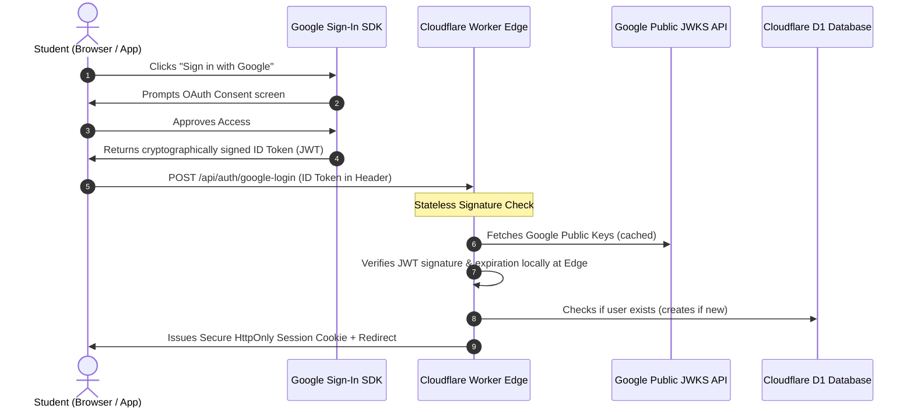

# Module 4: Authentication Systems & Security Architecture - English Vidya

## 1. Google Sign-In Integration (OIDC Standard)
To eliminate passwords, email-verification bugs, and friction for rural students, English Vidya relies entirely on **Google Sign-In** using the modern **Google Identity Services (GIS)** SDK. 

Social sign-in is highly secure, has zero SMS OTP costs, and leverages Google's advanced spam/bot protection filters.



### Native GIS Web Implementation

```javascript
// Web integration snippet for Google One-Tap and Button
window.onload = function () {
  google.accounts.id.initialize({
    client_id: "YOUR_GOOGLE_CLIENT_ID.apps.googleusercontent.com",
    callback: handleCredentialResponse,
    auto_select: true // One-tap sign in for returning students
  });
  
  // Render the official Google Button
  google.accounts.id.renderButton(
    document.getElementById("google-signin-btn"),
    { theme: "outline", size: "large", width: "100%" }
  );
  
  // Trigger One-Tap prompt
  google.accounts.id.prompt(); 
};

async function handleCredentialResponse(response) {
  // The raw credential is a Google ID Token (JWT)
  const idToken = response.credential;
  
  const res = await fetch('https://englishvidya.com/api/auth/google-login', {
    method: 'POST',
    headers: {
      'Content-Type': 'application/json'
    },
    body: JSON.stringify({ token: idToken })
  });
  
  if (res.ok) {
    window.location.href = '/dashboard';
  } else {
    alert("Authentication failed. Please try again.");
  }
}
```

---

## 2. Stateless Edge Verification (JWKS Public Keys)
To maintain massive scalability at zero cost, the backend Worker does not query the database to verify a student's session token on every request. Instead, it implements **stateless cryptographic signature validation**.

### Signature Validation Architecture
* Google signs ID tokens using asymmetric private keys.
* The Cloudflare Worker fetches Google's public JSON Web Key Sets (JWKS) from `https://www.googleapis.com/oauth2/v3/certs`.
* The Worker caches these public keys in **Cloudflare KV** (for up to 24 hours) to avoid network latency.
* When a student sends a request, the Worker decodes the JWT using high-performance, native Web Crypto APIs at the edge.
* If the signature is valid, the expiration date is future-facing, and the `aud` (audience) matches our Google Client ID, the user identity is trusted instantly.

---

## 3. Session Transport & Cookie Security
We store session tokens inside **Secure, HttpOnly Cookies** rather than `localStorage`.

### LocalStorage vs. HttpOnly Cookie Security
| Security Parameter | LocalStorage Storage | HttpOnly Cookie Storage | Why it matters |
| :--- | :--- | :--- | :--- |
| **JS Accessibility** | Yes (`localStorage.getItem()`) | **No** (Hidden from JavaScript) | If a student visits a page containing malicious third-party scripts (XSS), LocalStorage tokens can be stolen. HttpOnly cookies cannot be accessed by JS. |
| **CSRF Protection** | Highly immune | Vulnerable unless patched | Cookies are sent automatically by the browser, exposing them to cross-site request forgery. We mitigate this using strict directives. |
| **Mobile App Support** | Easy | Complex but highly secure | CapacitorJS supports native cookie handling across native bridges. |

### Secure Cookie Configuration Flags
When our Worker API issues the session cookie, it applies these exact flags:
```http
Set-Cookie: session_token=jwt_value_here; Secure; HttpOnly; SameSite=Lax; Max-Age=2592000; Path=/
```
* **HttpOnly:** Restricts JavaScript access, preventing token extraction.
* **Secure:** Ensures the browser only transmits the cookie over encrypted HTTPS connections.
* **SameSite=Lax:** Restricts automatic cookie transmission during cross-site requests, providing robust protection against Cross-Site Request Forgery (CSRF).
* **Max-Age=2592000:** Sets session persistence to 30 days.

---

## 4. Mobile Wrappers Native Google Sign-In
When wrapping the website into an Android and Windows App, standard iframe-based Google Sign-In is blocked by Google's native WebView security policies.

### Android Native Bridge (CapacitorJS)
We use the official **Capacitor Google Auth Plugin** (`@codetrix-studio/capacitor-google-auth`).
* The native Android SDK triggers the local Google Sign-In dialogue overlay natively.
* It returns the ID Token back to our Capacitor JavaScript layer.
* The PWA client sends this ID Token to our `https://englishvidya.com/api/auth/google-login` endpoint, exactly mimicking the web flow. This provides a unified backend codebase for web, Android, and desktop.

---

## 5. Security & Bot Prevention
Educational systems are prime targets for spam registrations, toxic commenting, and database flooding. We establish hard-coded edge defenses:

1. **Edge-Level Rate Limiting:** Cloudflare Workers enforce an IP-based rate limit of **100 API requests per minute** per user, preventing scraping of our premium database vocabulary cards.
2. **Google OAuth Verification:** Since registration requires a valid Google account, automated automated bots cannot register accounts. 
3. **Regex Content Sanitize:** All input parameters (e.g., in user comments) are recursively sanitized to remove HTML and script elements (`<script>`, `onerror=`, `javascript:` links), neutralizing Cross-Site Scripting (XSS) attempts.
4. **CORS Edge Blocking:** Cross-Origin Resource Sharing (CORS) rules on the Workers API allow requests strictly from `https://englishvidya.com` (and localhost during testing), blocking external client scraping scripts from invoking API endpoints.
