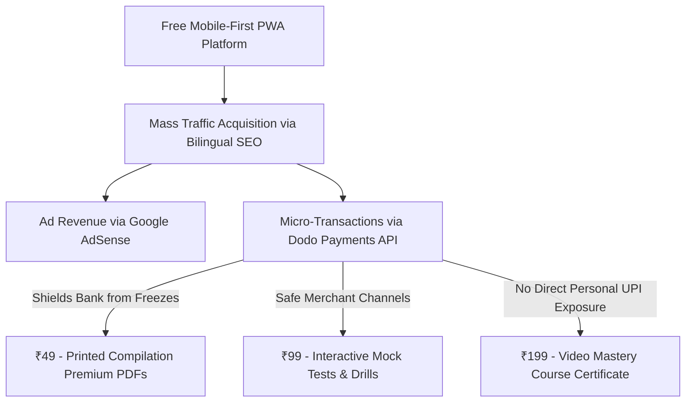

# Module 8: Monetization Strategy & Indian Growth Hacks - English Vidya

## 1. Dodo Payments Monetization Strategy (Shielded Bank Architecture)
Rural and beginner Indian students are highly sensitive to price and reject high-cost monthly SaaS subscriptions. Instead, the monetization model for English Vidya relies on **nominal micro-transactions (₹29 to ₹99)** and non-intrusive ad placement.

To prevent cyber fraud freezes—a common issue in India where a fraudulent transfer to a personal UPI ID can lead to cyber police freezing the entire linked bank account—**English Vidya utilizes Dodo Payments** as its secure payment processor and Merchant of Record (MoR).



### Micro-Transaction Product Catalog
| Premium Product | Price | Distribution Method | Technical Delivery |
| :--- | :--- | :--- | :--- |
| **Complete Print-Ready Grammar PDF Book** | **₹49** ($0.60) | High-quality compiled PDF encompassing all 60 grammar lessons. | Auto-generated PDF served securely from Cloudflare R2 after **Dodo Payments Webhook** verification. |
| **10,000 Sentence Spoken Drill PDF** | **₹29** ($0.35) | Drill patterns with English, Hindi translation, and Devanagari pronunciation. | Secure email download link dispatched via Resend API after Dodo Payments callback. |
| **Interactive Chapter-Wise Mock Tests** | **₹99** ($1.20) | Multi-stage interactive quiz engine with score breakdown. | Database unlocks access parameters inside profiles table after payment success. |

---

## 2. Dynamic PDF Branding (Organic Growth Loop)
Since rural learners frequently distribute files via WhatsApp, Telegram, and ShareIt, we transform our premium PDFs into **organic user-acquisition funnels**.

### Branding Funnel Tactics
1. **Interactive Internal Link Matrix:** Every PDF header and footer embeds a clickable hyperlink back to the interactive webpage:
   `👉 Click here to listen to the pronunciation of these words on englishvidya.com`
2. **Dynamic User Watermarking:** During download generation, the worker overlays the student’s custom referral URL as a subtle footer watermark. When a student shares the PDF with their classmates, any registration originating from that document tracks back to their profile (earning them streak points or premium course access).
3. **Encrypted QR Code Integration:** A distinct QR code placed on the cover page allows students holding printouts to scan the code with their smartphone and immediately resume the interactive pronunciation drills online.

---

## 3. Viral Indian Spoken Growth Hacks

### A. The "WhatsApp Status" Gamification Loop
In India, students love sharing their educational streaks and quiz achievements on their WhatsApp Status.

```
       [ Student Completes Lesson ]
                     |
         ( Earns +10 Streak Days )
                     |
         [ Trigger Achievement Card ]
         +------------------------+
         | I've maintained a 15-  |
         | day streak on English  |
         | Vidya! Join me to learn|
         | English for free!      |
         +------------------------+
                     |
          ( Tap: Share on WhatsApp )
                     |
       [ Pre-filled Referral link sent ]
```

* **The Share Action:** When a student hits a milestone (e.g., completes a Phase, secures a 100% quiz score), a modal renders a highly aesthetic, download-friendly graphic banner.
* **One-Click Share API:** Clicking the button triggers a web share API opening WhatsApp with a pre-filled bilingually optimized message:
  `मैंने English Vidya पर लगातार 10 दिनों तक पढ़ाई पूरी की! 🎓 क्या आप भी बिना रटे, शुरू से English सीखना चाहते हैं? यहाँ क्लिक करें: https://englishvidya.com/?ref=USER_ID`

### B. Local Cyber Cafe & Rural Teacher Partnerships
* **Cyber Cafe Affiliate Codes:** Cyber cafes in Tier-3 towns are the primary sources for student job application printouts. We offer cyber cafe operators distinct referral codes. Every PDF compilation printed and sold to job seekers triggers a **50% commission** paid instantly to the operator's UPI ID.
* **Rural School Teachers:** We provide free educational slides and lesson structures (Parts 1-60) to rural English school teachers. Teachers project our platform inside classrooms, utilizing our free interactive pronunciation helpers to assist students.

---

## 4. Future-Ready AI Expansion Roadmap
As technology evolves, the lightweight PWA is architected to seamlessly plug into AI capabilities without bloat.

1. **Edge AI Pronunciation Assessment (WebRTC + WebSpeech API):**
   Rather than using expensive cloud-based AI servers (like Whisper or Google Cloud Speech-to-Text), we run the SpeechRecognition browser engine natively inside the user's mobile browser. The app grades the student's pronunciation locally, offering a fully interactive speaking tutor at **zero API server cost**.
2. **AI Grammar Chatbot (Cloudflare AI Workers):**
   Using Cloudflare's serverless AI runner (`@cloudflare/ai`), we deploy a lightweight bilingual Large Language Model (e.g., Llama-3-8B-Instruct) at the edge. Students can ask grammar questions in Hindi (e.g., *"Sir, go and went me kya difference hai?"*) and receive instant explanations. Under Cloudflare Workers AI free tier, this executes at **zero hosting overhead**.
